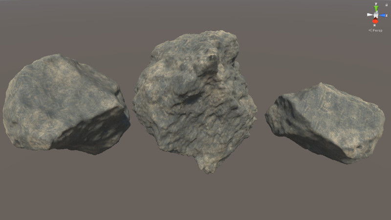

# Unity Procedural Rock Generation

Author: Przemyslaw Zaworski
 
Licence: MIT

Open the scene: Scenes/Main. Play. Click "Export" to save object as asset. Tested with Unity 2019.4.17f1

References:

* https://www.shadertoy.com/view/ldSSzV

* http://paulbourke.net/geometry/polygonise/ 

